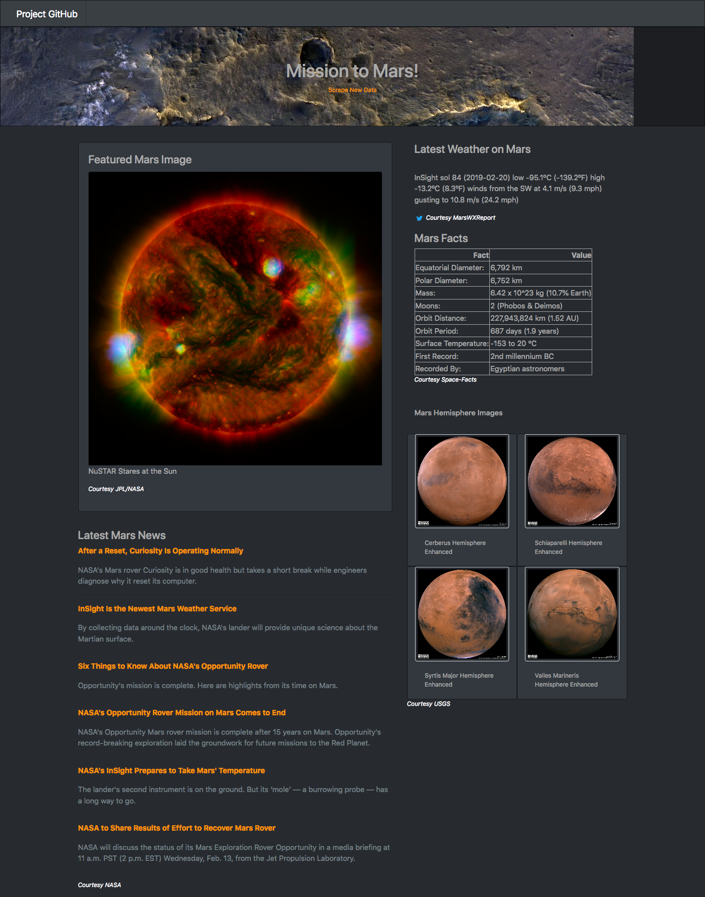
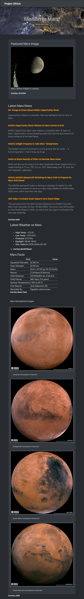

# Homework 12 - Web scraping/Mongo/Flask

In this homework, we built a web application that scrapes various websites for data related to the Mission to Mars and displays the information in a single HTML page.

* Scraped the NASA Mars News Site to collect the latest News Title and Paragraph Text.
* Scraped the JPL Mars Space Images for the Featured Image, using splinter to navigate the site and find the image url for the current Featured Mars Image and assemble a complete URL for the image.
* Scraped the Mars Weather twitter account for the latest Mars weather tweet.
* Used Pandas to scrape a table from the Mars Facts webpage containing facts about the planet including Diameter, Mass, etc and to convert the data to a HTML table string.
* Scraped the USGS Astrogeology site using Splinter to get links to the high resolution images for each of Mars' hemispheres.
* All information was inserted into a MongoDB collection and then that database was used to populate the HTML page, using Flask and PyMongo.

